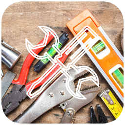

# GUI-OpenCanopy-Hackintosh-Life

#### GUI personalizzate Hackintosh Life:

## Sfondo

## Icone macOS

## Icone Recovery

## Icone Recovery Esterne (USB)

## Icona Windows

## Icona Linux

## Icona TM

## Icona TM Esterna

## Icona Shell

## Icona Tools

